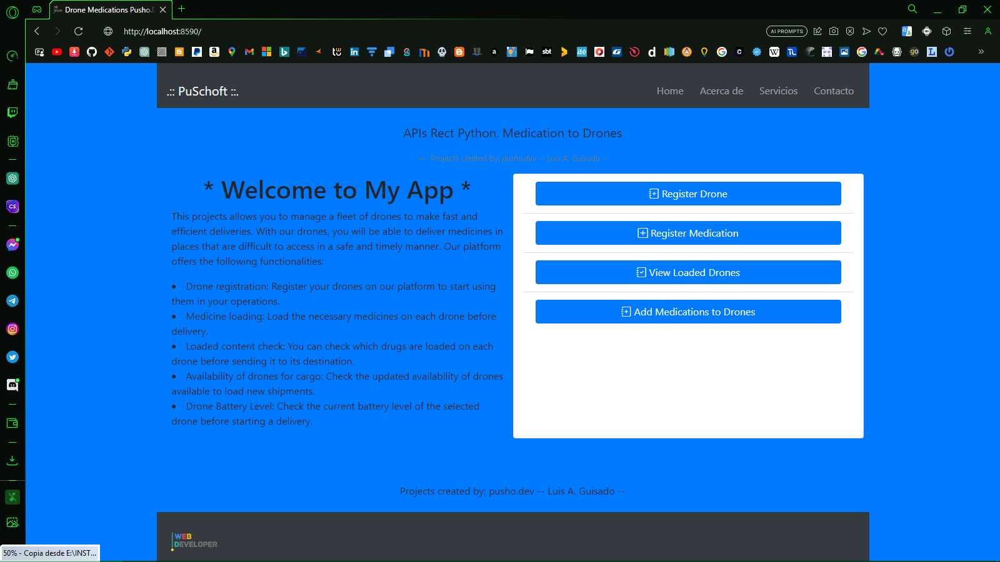

# Drone_Medications

REST API to manage drug delivery using drones

  

## Main features
1. Register Drone
2. Register Medication
3. Load Medications into a Drone
4. View Loaded Drones

## Prerequisites
1. [Visual Studio Code](https://code.visualstudio.com/download)
2. [Python](https://www.python.org/downloads/)
3. [XAMPP](https://www.apachefriends.org/index.html)

## Installation
1. Create a virtual environment: `python -m venv registro_dm`
2. Activate the environment: `.\registro_dm\Scripts\activate`
3. Install the requirements.txt file: `pip install -r requirements.txt`
4 .Create or import register_dm.sql database.
5 .Run: app.py 6.- localhost:8590 or http://127.
0 .0 .1 :8590

## Contribution 
I would love to know if you like my project and how I can improve it further!

## License 
This project is free to use, with the only condition being informed of its destination and usage.

## Contact 
- Email 1: lguisado90@gmail.com  
- Email 2: bethocubans1990@hotmail.com  
- Personal Blog: [Puschoft's Blog](https://puschoft.blogspot.com)